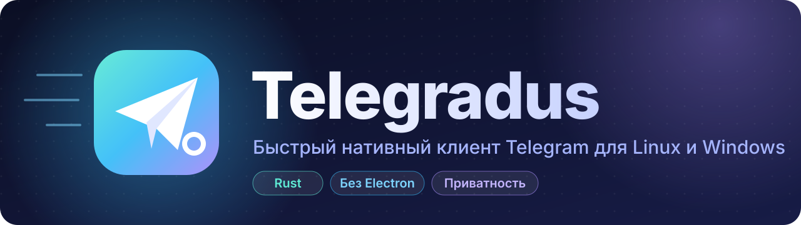
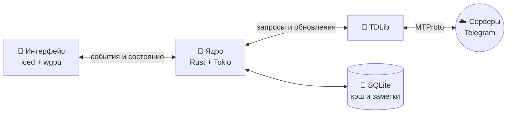

<div align="center">



<br>

**Лёгкий. Быстрый. Твой.**<br>
Десктопный клиент Telegram на Rust, который не превращает твой компьютер в обогреватель.

<br>


[Зачем](#-зачем-ещё-один-клиент) •
[Возможности](#-возможности) •
[Технологии](#-технологии) •
[Дорожная карта](#-дорожная-карта) •
[Сборка](#-сборка-из-исходников) •
[FAQ](#-faq)

</div>

---

## 💡 Зачем ещё один клиент

Большинство современных десктопных мессенджеров — это браузер, притворяющийся приложением.
Telegradus идёт другим путём:

<table>
<tr>
<td width="33%" valign="top">

### ⚡ Скорость
Нативный код на Rust и отрисовка интерфейса на GPU.
Никакого Electron, никакого встроенного Chromium.

</td>
<td width="33%" valign="top">

### 🪶 Лёгкость
Каждый мегабайт памяти на счету. Медиа грузится лениво,
кэш под контролем, фоновые процессы — только нужные.

</td>
<td width="33%" valign="top">

### 🛡️ Контроль
Ты решаешь, что видят другие: статус «в сети»,
«печатает», «прочитано». Всё настраивается.

</td>
</tr>
</table>

## ✨ Возможности

### Основа

| | Функция | Описание |
|:-:|---|---|
| 🔐 | **Вход** | По номеру телефона, QR-коду, с поддержкой облачного пароля (2FA) |
| 💬 | **Чаты** | Личные, группы, супергруппы, каналы, ветки обсуждений |
| 📁 | **Папки** | Папки Telegram, закрепы, архив, счётчики непрочитанных |
| ✍️ | **Сообщения** | Ответы, пересылка, редактирование, удаление, реакции, форматирование |
| 🖼️ | **Медиа** | Фото, видео, файлы, голосовые, кружочки, стикеры, GIF |
| 🔍 | **Поиск** | По чатам, сообщениям и медиа — быстрый и локальный там, где можно |
| 🔔 | **Уведомления** | Системные, с быстрым ответом прямо из уведомления |
| 👥 | **Мультиаккаунт** | Несколько аккаунтов в одном окне без ограничений |

### Фишки Telegradus

| | Функция | Описание |
|:-:|---|---|
| 👻 | **Режим призрака** | Не отправлять «прочитано», «печатает» и «в сети» — глобально или для отдельных чатов |
| 🗑️ | **История правок и удалений** | Локально сохраняет удалённые и изменённые сообщения. Выключено по умолчанию |
| 🏷️ | **Локальные заметки** | Свои имена и заметки к контактам, которые видишь только ты |
| 🧠 | **Умные папки** | Папки по правилам: «непрочитанные упоминания за сутки», «каналы без звука» и т. д. |
| ⏰ | **Отложенные и шаблоны** | Запланированные сообщения и быстрые ответы по горячим клавишам |
| 🎯 | **Режим фокуса** | Приглушить всё, кроме выбранных чатов, на заданное время |
| 🌐 | **Перевод** | Перевод сообщений прямо в ленте чата |
| 📤 | **Экспорт** | Выгрузка чатов в JSON, HTML или Markdown |
| 🎨 | **Кастомизация** | Темы, шрифты, плотность списка, скрытие Stories и рекламы в каналах |
| 🔒 | **Защита** | PIN-код на запуск и автоблокировка при бездействии |
| ⌨️ | **Клавиатура** | Всё управление с клавиатуры и палитра команд по <kbd>Ctrl</kbd> + <kbd>K</kbd> |

## 🎯 Цели по производительности

Это ориентиры, на которые проект равняется с первого дня. Каждое изменение проверяется на соответствие им.

| Метрика | Цель |
|---|---|
| 🚀 Холодный запуск до списка чатов | **< 1 с** |
| 🧮 Память в простое, 1 аккаунт | **< 150 МБ** |
| 🎞️ Прокрутка чата | **стабильные 60+ FPS** |
| 💤 Нагрузка на CPU в фоне | **≈ 0 %** |
| 📦 Размер установщика | **< 40 МБ** |

## 🧰 Технологии

<div align="center">

| Слой | Инструмент | Почему |
|---|---|---|
| Язык | [**Rust**](https://www.rust-lang.org/) | Скорость C++, безопасность памяти, никакого сборщика мусора |
| Интерфейс | [**iced**](https://iced.rs/) | Нативный GPU-рендеринг через wgpu (Vulkan / DirectX 12 / OpenGL) |
| Протокол | [**TDLib**](https://core.telegram.org/tdlib) | Официальная библиотека Telegram: MTProto, шифрование, синхронизация |
| Асинхронность | [**Tokio**](https://tokio.rs/) | Сеть и загрузки не блокируют интерфейс |
| Хранилище | [**SQLite**](https://sqlite.org/) | Локальный кэш, заметки, история правок |

</div>

### Архитектура



Интерфейс ничего не знает о сети: он только отображает состояние и отправляет намерения пользователя в ядро.
Ядро общается с TDLib в отдельной задаче, поэтому даже медленная сеть не подвешивает окно.

## 🖥️ Платформы

| Платформа | Поддержка | Формат |
|---|:-:|---|
|  **Arch Linux** | ✅ основная | AUR: `telegradus-bin`, `telegradus-git` |
|  **Другие Linux** | 🟡 планируется | AppImage, Flatpak |
| 🪟 **Windows 10 / 11** | ✅ основная | Установщик `.msi` и portable-версия |

Поддерживаются Wayland и X11. На Linux интерфейс рендерится через Vulkan, на Windows — через DirectX 12.

## 🧭 Дорожная карта

<details open>
<summary><b>🧱 Этап 0 — Фундамент</b></summary>

- [ ] Каркас проекта на Rust, CI для Linux и Windows
- [ ] Подключение и сборка TDLib
- [ ] Архитектура «ядро ↔ интерфейс»

</details>

<details open>
<summary><b>💬 Этап 1 — Минимально рабочий клиент</b></summary>

- [ ] Вход по номеру, коду, 2FA и QR
- [ ] Список чатов с папками
- [ ] Лента сообщений с виртуальной прокруткой
- [ ] Отправка текста, ответы, редактирование, удаление
- [ ] Фото и файлы
- [ ] Системные уведомления

</details>

<details>
<summary><b>🎨 Этап 2 — Полноценный мессенджер</b></summary>

- [ ] Видео, голосовые, кружочки, стикеры, GIF
- [ ] Реакции, пересылка, закрепы
- [ ] Поиск по сообщениям
- [ ] Темы и настройки внешнего вида
- [ ] Мультиаккаунт

</details>

<details>
<summary><b>🔥 Этап 3 — Фишки Telegradus</b></summary>

- [ ] Режим призрака
- [ ] История правок и удалений
- [ ] Локальные заметки и имена
- [ ] Умные папки и режим фокуса
- [ ] Палитра команд
- [ ] Экспорт чатов

</details>

<details>
<summary><b>📦 Этап 4 — Релиз</b></summary>

- [ ] Пакеты в AUR
- [ ] Установщик для Windows
- [ ] Автообновление
- [ ] Первый стабильный релиз 🎉

</details>

## 🔨 Сборка из исходников

> [!NOTE]
> Проект на стадии фундамента: код появится с завершением этапа 0.
> Ниже — то, как будет выглядеть сборка.

Для работы нужны свои `api_id` и `api_hash` — их можно получить на [my.telegram.org](https://my.telegram.org/apps).

<details>
<summary><b> Arch Linux</b></summary>

```bash
# Зависимости
sudo pacman -S --needed rustup base-devel cmake gperf openssl zlib
rustup default stable

# Сборка
git clone https://github.com/ilovevodkaa/Telegradus.git
cd Telegradus
cargo build --release
```

</details>

<details>
<summary><b>🪟 Windows</b></summary>

```powershell
# Нужны: Rust (rustup.rs), Visual Studio Build Tools с C++, CMake
git clone https://github.com/ilovevodkaa/Telegradus.git
cd Telegradus
cargo build --release
```

</details>

## ❓ FAQ

<details>
<summary><b>Это официальный клиент Telegram?</b></summary>
<br>
Нет. Telegradus — независимый сторонний клиент. Он работает через официальную библиотеку TDLib и соблюдает
<a href="https://core.telegram.org/api/terms">правила Telegram API</a>, но не связан с Telegram FZ-LLC.
</details>

<details>
<summary><b>Почему не Electron или Tauri?</b></summary>
<br>
Electron тащит с собой целый Chromium и легко съедает сотни мегабайт памяти. Tauri легче, но на Linux
опирается на WebKitGTK, который работает по-разному в разных дистрибутивах. Нативный интерфейс на iced
выглядит и ведёт себя одинаково на Arch и на Windows и расходует заметно меньше ресурсов.
</details>

<details>
<summary><b>Это безопасно для моего аккаунта?</b></summary>
<br>
Авторизация и шифрование полностью на стороне TDLib — той же библиотеки, что лежит в основе многих
клиентов Telegram. Ключи сессии хранятся только локально на твоём компьютере.
</details>

<details>
<summary><b>Будет ли версия для macOS?</b></summary>
<br>
Технически стек это позволяет, но сейчас фокус на Linux и Windows. После первого релиза — посмотрим.
</details>

## 🤝 Участие

Проект только начинается — самое время присоединиться! Идеи, баг-репорты и пул-реквесты приветствуются
в [Issues](https://github.com/ilovevodkaa/Telegradus/issues).

---

<div align="center">

<sub>Сделано с ❤️ и щепоткой градусов</sub><br>
<sub>Telegradus не является официальным продуктом Telegram и не связан с Telegram FZ-LLC.</sub>

</div>
